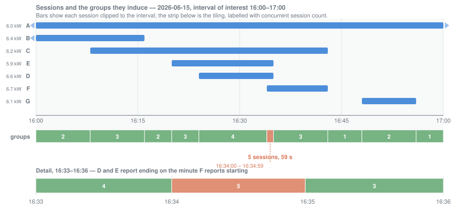

# Session grouping, worked through

How a set of overlapping charging sessions becomes the `SessionGroup`s that the peak estimate is
computed from. The arrangement below is a deliberately awkward one: it contains every shape the
grouping logic has to get right, and it is pinned by
[`tests/session_grouping_diagram.rs`](../tests/session_grouping_diagram.rs), which drives the real
pipeline over [`tests/fixtures/Session_Report_Diagram.csv`](../tests/fixtures/Session_Report_Diagram.csv)
and asserts every number on this page.



## The scenario

Seven sessions, on 2026-06-15, against an interval of interest of **16:00–17:00** local. Session A
starts before the interval and ends after it, so it is clipped at both ends. Every session draws
between 5.9 and 6.7 kW — what Evolute's smart breakers allow — so none of them is an outlier.

| Session | Start | End | `Conn_Duration` | `Active_Charge_Time` | `Energy_Use` | Avg power |
|---|---|---|---|---|---|---|
| A | 15:54 | 17:03 | 1:09:00 | 1:09:00 | 6.900 | 6.0 kW |
| B | 15:59 | 16:15 | 0:16:00 | 0:15:00 | 1.600 | 6.4 kW |
| C | 16:08 | 16:42 | 0:34:00 | 0:30:00 | 3.100 | 6.2 kW |
| D | 16:24 | 16:34 | 0:10:00 | 0:10:00 | 1.100 | 6.6 kW |
| E | 16:20 | 16:34 | 0:14:00 | 0:12:00 | 1.180 | 5.9 kW |
| F | 16:34 | 16:42 | 0:08:00 | 0:06:00 | 0.670 | 6.7 kW |
| G | 16:48 | 16:55 | 0:07:00 | 0:06:00 | 0.610 | 6.1 kW |

Two coincidences carry most of the interest. **D and E both report ending at 16:34, the same minute
F reports starting.** And **C and F both report ending at 16:42.**

No group here reaches the panel's concurrency limit of ten, so only the `direct` estimates are
reported and no `clamped` set is produced. See README.md, "Limitations".

## The groups

A session group is a maximal stretch of time over which the set of active sessions does not change.
The groups are contiguous and non-overlapping, and here they tile the whole hour, because A spans it
end to end.

| # | From | To | Length | Sessions | Count | Aggregate |
|---|---|---|---|---|---|---|
| 0 | 16:00:00 | 16:08:00 | 8:00 | A, B | 2 | 12.4 kW |
| 1 | 16:08:00 | 16:16:00 | 8:00 | A, B, C | 3 | 18.6 kW |
| 2 | 16:16:00 | 16:20:00 | 4:00 | A, C | 2 | 12.2 kW |
| 3 | 16:20:00 | 16:24:00 | 4:00 | A, C, E | 3 | 18.1 kW |
| 4 | 16:24:00 | 16:34:00 | 10:00 | A, C, D, E | 4 | 24.7 kW |
| **5** | **16:34:00** | **16:35:00** | **1:00** | **A, C, D, E, F** | **5** | **31.4 kW** |
| 6 | 16:35:00 | 16:43:00 | 8:00 | A, C, F | 3 | 18.9 kW |
| 7 | 16:43:00 | 16:48:00 | 5:00 | A | 1 | 6.0 kW |
| 8 | 16:48:00 | 16:56:00 | 8:00 | A, G | 2 | 12.1 kW |
| 9 | 16:56:00 | 17:00:00 | 4:00 | A | 1 | 6.0 kW |

Groups, sessions and the interval of interest are all **half-open**: each runs from its start
inclusive to its end exclusive. That is what lets the lengths above sum to exactly 60:00 with no
instant counted twice and none left out — closed intervals could not tile the hour at all, since
adjacent groups would either share an instant or leave a gap between them.

## Why group 5 lasts a minute

The session report gives start and end times to the minute, with no seconds. A session reported to
end at 16:34 actually ended at some unknown instant in `[16:34:00, 16:35:00)`. The ingestion step
therefore computes `Adj_conn_end` as the reported end plus 60 seconds — the *exclusive* end of the
window the true end lies in — so that wherever in that minute the session really stopped, it falls
inside the session as recorded. See README.md, "Session boundaries".

That padding is what produces group 5. D and E are recorded as running until 16:35:00, while F is
recorded as starting at 16:34:00 — so for that whole minute all five sessions are drawing at once:

```
              16:33          16:34          16:35          16:36
                |              |              |              |
   D  ===========================>                D, E end 16:34 -> run until 16:35:00
   E  ===========================>
   F                |=========================================>    F starts 16:34:00
                    |           |
   groups     4     |     5     |         3
                    +-----------+
                        60 s
```

This is not an artefact to be smoothed away. Those five cars really may have been drawing
simultaneously, and a demand charge is billed on the peak, however brief. The alternative — treating
a session as ending at the start of its final minute — would silently discard the overlap and
under-report the peak.

The group is exactly one minute long because a minute is the whole of the uncertainty: it is the
resolution the report states session boundaries at, and the software carries that one figure as
`SESSION_BOUNDARY_RESOLUTION`.

## The estimates

Group 5 carries both the highest aggregate power and the highest session count, so both estimates
are drawn from it:

| | kW | kVA | From group |
|---|---|---|---|
| Consumption-based | 31.400 | 33.053 | 5 |
| Breaker-spec-based | 33.500 | 37.500 | 5 |

The consumption figure is the sum of the five sessions' average power. The breaker figure is
5 × 6.7 kW and 5 × 7.5 kVA, the smart breaker ratings. Together they bracket the true peak: the
actual demand lay somewhere between 31.4 and 33.5 kW.

The two estimates land on the same group here, and with Evolute's infrastructure that is the usual
case — every session is capped near 6.7 kW, so aggregate power tracks session count closely. The two
can still select *different* groups when several groups tie on the highest count, since the tie is
broken by taking the earliest while the consumption figure is free to peak at any of them. That is
what happens in the June 2026 sample report.

## Regenerating the figure

`session-grouping.svg` is generated, not hand-drawn, from the same session times and group
boundaries the test asserts. Run from the repository root:

```sh
python3 docs/gen_session_grouping_svg.py
```

If the scenario changes, edit the `SESSIONS` and `GROUPS` constants at the top of that script and
regenerate, rather than editing the SVG — and update the tables above and the CSV fixture to match.
